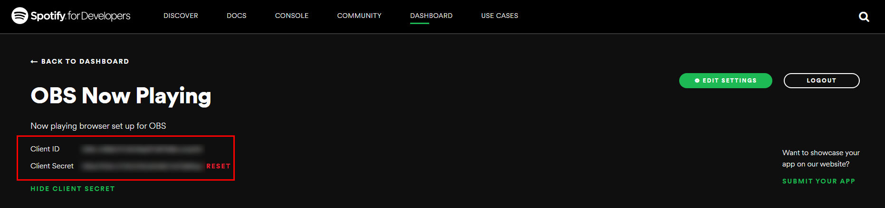
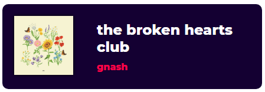

# Now Playing Spotify for OBS

A fully customisable node.js based browser source for OBS that fetches the users current playing song.

To run, you must follow and setup your app as developer on Spotify. Follow this [tutorial](https://developer.spotify.com/dashboard/). You also need to have node js already installed:

1. Add your project on Spotify for Developers dashboard. You can name it whatever you like.
2. Copy down the client ID and client secret. For example, in my set up for the project called OBS Now Playing, I have:\

3. Create a .env file and add these as so.
```
CLIENT_ID="<client id>"
CLIENT_SECRET='<client secret>'
REDIRECT_URI="<redirect uri>"
```
Note that you need to add `http://localhost:8888/callback` and `http://localhost:8888` to the Redirect URIs in the Developers Dashboard. You can find these under Edit Settings. My redirect URI in .env is 'http://localhost:8000/callback'.
4. Now, run `npm install` in this repo folder. Once the dependencies are done installing, run `node app.js`.
5. If all goes well, it should say 'Listening on 8888' in your console. Now open up localhost:8888 in browser, sign in and grant access.
6. You should see the now playing song in the browser:

7. Copy the link generated in the browser and add that as a browser source in OBS with login appended. For example, I'll add
`http://localhost:8000/login`
Optimal size is 1300x500.
To modify how the now playing looks in the browser, you can play around with [styles.css](public/styles.css).
